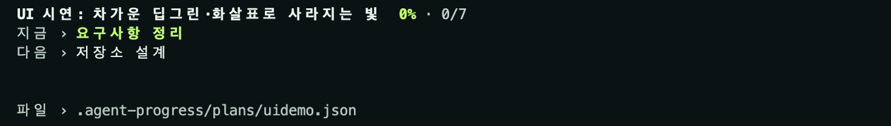

# agent-progress

**코딩 에이전트가 지금 무엇을 하고 있고, 다음에 무엇을 할지 한눈에 보는 터미널 진행 창.**

에이전트가 `ap` 명령으로 계획을 기록하고, 보고 싶을 때 `ap open`을 하면 에이전트 pane 바로 아래에 진행
창이 열려 목표·진행률·지금 하는 일·막힌 이유·다음 일을 보여줍니다. 사용자는 아무것도 등록하지 않습니다.



<sub>실제 `ap view` TUI를 [VHS](https://github.com/charmbracelet/vhs)로 녹화했습니다
([mp4](docs/media/progress.mp4)). 다시 찍으려면 `scripts/demo/record.sh`.</sub>

## 설치

macOS Apple Silicon용입니다. Linux는 검증하지 않았고, Windows는 지원하지 않습니다(pane 확인에 `ps`를 씁니다).

```sh
brew tap justn-hyeok/agent-progress https://github.com/justn-hyeok/agent-progress
brew install justn-hyeok/agent-progress/agent-progress
ap skill install        # 에이전트가 시키지 않아도 ap를 쓰게 합니다
```

[릴리즈](https://github.com/justn-hyeok/agent-progress/releases/latest)의 `.tar.gz`와 체크섬으로 직접 설치할
수도 있습니다([배포 문서](docs/distribution.md)). Rust·Node·서버는 필요 없습니다. 진행 창 자동 배치에는
[Herdr](https://herdr.dev) 또는 tmux가 필요합니다.

## 에이전트가 스스로 쓰게 하기

```sh
ap skill install --dry-run   # 바뀔 내용만 보기
ap skill install             # 설치
ap skill remove              # ap가 설치한 것만 되돌리기
```

- 바이너리에 내장된 스킬([skills/ap/SKILL.md](skills/ap/SKILL.md))을 `~/.agents/skills/ap`에 설치합니다.
  Cursor·Copilot·Cline·OMP·Gemini·Devin·pi·Command Code·Amp는 이 폴더를 직접 읽습니다.
- `~/.agents/skills`를 읽지 않는 Claude Code·Codex·OpenCode·Antigravity의 스킬 폴더가 있으면 링크를 겁니다.
- Claude Code는 목록에 있는 스킬을 스스로 잘 꺼내 쓰지 않으므로 `~/.claude/CLAUDE.md`에 표시된 지침
  블록을 추가합니다. 기존 파일은 `CLAUDE.md.ap-backup-<시각>`으로 백업합니다.
- ap가 설치하지 않은 같은 이름의 스킬이나 링크는 건드리지 않습니다. GJC(스캔 폴더에 실제 디렉터리 필요)와
  Hermes(`skills.external_dirs` 등록)는 별도로 등록합니다.

## 명령

에이전트가 부르는 명령입니다. ID나 revision을 넘기지 않습니다.

```sh
ap goal "로그인 버그 수정"
ap add "원인 재현" "토큰 갱신 수정" "회귀 테스트"   # 1, 2, 3
ap start 1
ap done 1
ap block 2 "스테이징 키 필요" --needs user
ap cancel 3 "범위 밖"
ap todo 2            # 다시 예정으로
ap rm 3              # 잘못 넣은 항목 지우기 (다른 번호는 그대로)
ap new               # 지금 계획을 보관하고 새로 시작
ap status            # 지금 계획 출력 (--json)
ap history           # 변경 이력 (JSONL)
ap open / ap close   # 이 pane의 진행 창 열기 / 닫기 (기본으로는 저절로 열리지 않음)
ap view              # 지금 터미널에서 진행 창 실행
```

- 항목은 출력에 보이는 번호나 정확한 제목으로 고릅니다. 번호는 한 번 정해지면 바뀌지 않습니다.
- 진행률은 완료 ÷ (전체 − 취소)입니다. 소수점 둘째 자리까지 보이며(`66.67%`), 다 끝나기 전에는 100%가,
  하나라도 끝났으면 0%가 되지 않습니다. 항목이 없으면 `미정`입니다.
- 진행률은 완료 보고 비율일 뿐, 제품 완성도나 남은 시간이 아닙니다. 완료도 에이전트의 보고이며 검증이
  아닙니다.

## 진행 창

```
  로그인 버그 수정  66.67% · 2/3
  지금 › 토큰 갱신 수정
  다음 › 회귀 테스트
  완료 › 원인 재현
  파일 › .agent-progress/plans/herdr-w6G_p1.json
```

- 줄은 역할로 나뉩니다(작은 창에서도 막힘이 먼저): `막힘 ›` 막힌 이유와 필요한 사람, `지금 ›` 진행 중, `다음 ›`, `완료 ›` 마지막 완료,
  맨 아래 흐린 `파일 ›`. 진행 중 항목이 동시에 둘 이상이면 계획과 실제 작업이 어긋난 것이므로 각각
  경고색으로 보여줍니다. 창이 8줄 이상이면 체크리스트도 펼쳐집니다.
- 배경 채움은 진행 경계에서 넓게 퍼지는 그라데이션으로 트랙에 녹아들고, 100%는 꽉 채웁니다.
- 단계를 끝내면 채움이 새 위치까지 짧게 밀려갑니다. 진행률이 내려가면(`ap new`, `todo` 등) 밀리지 않고 바로
  바뀝니다.
- 마지막 기록 후 `AP_IDLE_SECS`(기본 300초) 동안 빛 띠가 채움 안을 경계 쪽으로 흐르며 `>` 모양으로 휘고,
  뒤에 옅은 꼬리를 끌며 경계를 살짝 지나 사라집니다. 흐르던 빛은 완료나 기록 중단에도 끊기지 않고 끝까지
  가며, 다음 빛은 채움이 멈춘 뒤 왼쪽에서 새로 시작합니다. 빛은 "최근에 기록됨"을
  뜻할 뿐 에이전트가 실행 중이라는 증거는 아닙니다.
- 빈 칸은 `▀`로 위아래 두 픽셀을 그려 세로 해상도가 두 배입니다. 글자가 있는 칸은 글자를 건드리지 않습니다.
- 움직일 때만 초당 8프레임, 그 외에는 초당 2번만 확인합니다. 바뀐 칸만 다시 그립니다.
- 키 없이 상태를 볼 수 있습니다. 필요하면 `↑↓`/`j k` 목록, `Enter` 상세, `/` 검색, `f` 미완료만,
  `h` 변경 이력, `?` 도움말, `Esc` 돌아가기, `q` 닫기.
- 진행 창은 기본으로 저절로 열리지 않습니다. `ap open`으로 열면 그 pane에서 이어지는 기록을 계속 따라가고,
  `AP_AUTO_OPEN=1`이면 첫 기록 때 자동으로 엽니다.
- pane 하나에는 진행 창이 하나만 뜹니다. 같은 pane에서 다른 프로젝트(예: 레포와 worktree)의 계획을 기록하면
  새 창을 열지 않고 마지막으로 바뀐 계획으로 화면을 바꿉니다.
- 아래에 셸만 실행 중인 pane이 있으면 그 pane을 씁니다(닫으면 셸로 돌아감). 없으면 새로 나눕니다.
- `q`, `ap close`, 또는 Herdr에서 pane을 직접 닫으면 다시 열리지 않습니다(`AP_AUTO_OPEN=1`이어도). `ap open`으로
  다시 엽니다.
- 창 열기에 실패해도 기록은 저장됩니다. 계획 파일이 손상되면 덮어쓰지 않고 오류를 보고하며, 진행 창은
  마지막 정상 상태를 표시합니다.

## 어떤 계획인지 찾는 방법

추측하지 않고 환경과 실제 프로세스로 확인합니다.

| 우선순위 | 키 | 진행 창 |
| --- | --- | --- |
| `--plan NAME` / `AP_PLAN` | 지정한 이름 | 호출한 pane 아래 |
| `HERDR_PANE_ID` (그 pane의 프로세스가 `ap`의 조상일 때만) | `herdr-<pane>` | Herdr pane 아래 |
| Codex 공유 데몬 (`CODEX_THREAD_ID`) | `codex-<thread>` | 스레드 이름이 제목인 유일한 Codex pane 아래 |
| Cline 공유 데몬 | `herdr-<pane>` | 프로젝트에서 실행 중인 유일한 Cline pane 아래 |
| `TMUX_PANE` | `tmux-<pane>` | tmux pane 아래 |
| 그 외 | `default` | `ap view`로 직접 |

- 계획은 Git 루트(없으면 현재 디렉터리)의 `.agent-progress/plans/<key>.json`에 저장되므로 하위
  디렉터리에서 실행해도 같은 계획을 씁니다. `.agent-progress/.gitignore`를 자동으로 만들어 커밋되지 않습니다.
- 같은 pane ID가 다른 terminal에 재사용되면 이전 계획은 보관되고 새로 시작합니다.
- Codex와 Cline은 명령을 공유 데몬에서 실행해 `HERDR_PANE_ID`가 다른 pane을 가리키거나 아예 없습니다.
  후보가 정확히 하나일 때만 열고, 없거나 여럿이면 열지 않고 `ap --plan <key> view` 사용법을 알려줍니다.
  Codex 스레드 이름은 첫 응답 뒤에 정해지므로 그 전에는 `ap open`이 pane을 찾지 못합니다.

## 지원 하네스

셸 명령을 실행할 수 있는 에이전트라면 어디서든 기록할 수 있습니다. 아래는 Herdr에서 진행 창이 에이전트
pane 바로 아래에 자동으로 열리는 것을 실제로 확인한 목록입니다(2026-10-06~08).

| 하네스 | pane 확인 방식 | 스킬 위치 |
| --- | --- | --- |
| Claude Code | 조상 프로세스 | `~/.claude/skills` + CLAUDE.md 지침 |
| Codex 0.160 | 공유 데몬 → 스레드 이름 제목 | `~/.codex/skills` |
| OpenCode 2.0 | 조상 프로세스 | `~/.config/opencode/skills` |
| Cursor CLI | 조상 프로세스 | `~/.agents/skills` |
| Copilot CLI | 조상 프로세스 | `~/.agents/skills` |
| Cline 3.0 | 공유 데몬 → 프로젝트의 유일한 Cline pane | `~/.agents/skills` |
| OMP | 조상 프로세스 | `~/.agents/skills` |
| Gemini CLI 0.62 | 조상 프로세스 | `~/.agents/skills` |
| Devin CLI | 조상 프로세스 | `~/.agents/skills` |
| pi | 조상 프로세스 | `~/.agents/skills` |
| Antigravity CLI (agy) | 조상 프로세스 | `~/.gemini/antigravity-cli/skills` |
| Command Code | 조상 프로세스 | `~/.agents/skills` |
| Amp | 조상 프로세스 | `~/.agents/skills` |
| Hermes | 조상 프로세스 | `skills.external_dirs` |
| GJC | 조상 프로세스 | 스캔 폴더에 실제 디렉터리 |

tmux도 Herdr 대신 쓸 수 있는 터미널로 확인했습니다.

## 설정

| 항목 | 기본값 | 설명 |
| --- | --- | --- |
| `AP_PANE_SIZE` | `10` | 새로 나누는 진행 창 높이(%, 10–50) |
| `AP_AUTO_OPEN=1` | 꺼짐 | 첫 기록 때 진행 창 자동으로 열기 (`--no-view`로 한 번 건너뛰기) |
| `AP_IDLE_SECS` | `300` | 마지막 기록 후 빛이 흐르는 시간(초) |
| `AP_PLAN` / `--plan` | 자동 | 계획 이름 직접 지정 |
| `AP_HALF_BLOCKS=0` | 켜짐 | `▀` 반 칸 픽셀 끄기 (모호한 폭 문자를 두 칸으로 그리는 터미널용) |

색은 프로젝트의 `.agent-progress/ui.json`에서 바꿀 수 있습니다. 모든 값은 `#RRGGBB`이고 생략한 값은
기본 테마(차가운 딥그린)를 씁니다.

```json
{
  "theme": {
    "track": "#0C1316", "fill": "#1F4842", "glow": "#5CD6B8",
    "accent": "#C7F96C", "text": "#F2F5EE", "muted": "#C4D0C6",
    "metadata": "#B6C4BA", "warning": "#F5C26F"
  }
}
```

## 파일 위치

| 경로 | 내용 |
| --- | --- |
| `<git 루트>/.agent-progress/plans/<key>.json` | 계획 (원자적 저장, 잠금) |
| `<key>.history.jsonl` | 변경 이력 |
| `<key>.<시각>-<n>.archived.json` | `ap new` 등으로 보관한 이전 계획과 이력 |
| `~/.local/state/agent-progress/panes/` | pane별 진행 창 상태와 생존 신호 (`XDG_STATE_HOME` 우선) |

## 제거

```sh
ap skill remove                                   # 스킬·링크·CLAUDE.md 블록
brew uninstall agent-progress                     # 또는 sh install.sh --uninstall
```

프로젝트의 `.agent-progress/` 데이터는 지우지 않습니다.

## 개발

```sh
cargo test
cargo clippy --all-targets -- -D warnings
python3 scripts/package.py --output dist && python3 scripts/package_smoke.py dist/<archive> [--previous <old archive>]
AP_PREVIEW_DIR=/tmp/p cargo test dump_previews -- --ignored && python3 scripts/render_preview.py /tmp/p
scripts/demo/record.sh                            # README 녹화 (VHS 필요)
```

문서 목록은 [docs/README.md](docs/README.md)에 있습니다. 3.0.0 이전의 훅·런처·v2 작업 기록 방식은
Git 이력과 [CHANGELOG](CHANGELOG.md)에 남아 있습니다.
